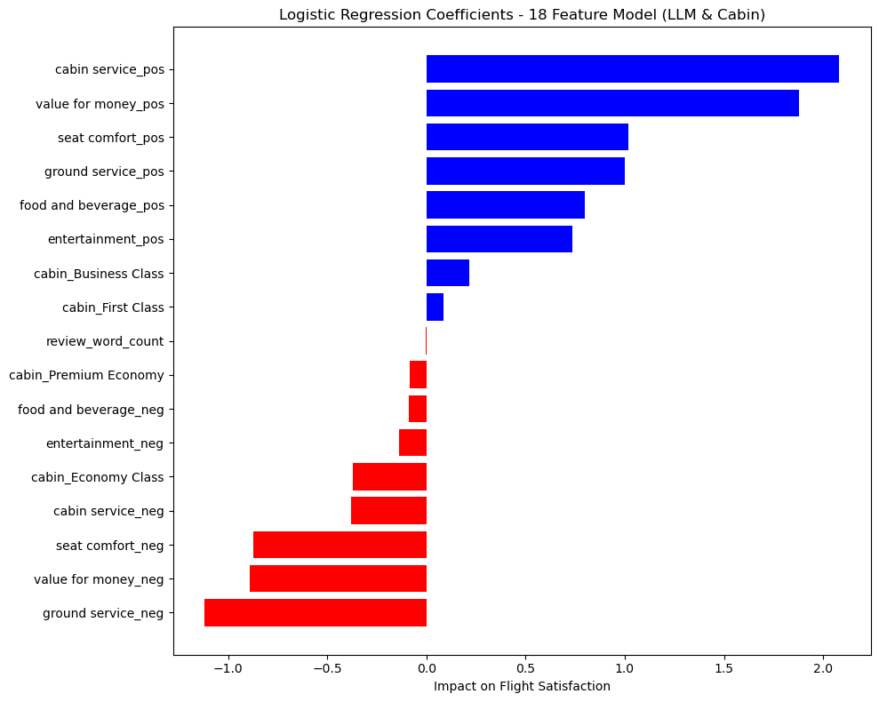

# WE CAN ALL BE CAPTAINS

This data science project analyzes 60,000 flight reviews using advanced Natural Language Processing (NLP) techniques, specifically focusing on topic modeling and sentiment analysis. Our goal is to provide a comprehensive overview of the current state of air travel globally. The project leverages the latest developments in Large Language Models (LLMs) to demonstrate how NLP can facilitate large-scale public engagement, particularly in sectors like aviation that operate as quasi-public utilities.

The advent of LLMs marks a significant milestone, offering unprecedented opportunities for individuals to interact with governments and other large organizations efficiently. This analysis serves as a case study in harnessing the power of NLP for public discourse, highlighting the potential of AI agents to assist in navigating complex surveys or official documents, ultimately making such interactions more user-friendly and accessible.

Through this project, we envision a future where AI-enhanced communication enables a more democratic and responsive engagement between the public and sectors critical to everyday life, like aviation. By applying sophisticated NLP methodologies, we aim to unlock insights into passenger experiences and expectations, paving the way for improved service standards and more informed public policies.

## Executive Summary

n 2019, the world witnessed over 4.5 billion air travelers, underscoring the monumental scale of global mobility enabled by advancements in engineering and system design. These travelers flew for various reasons: work, connecting with family and friends, or exploring new destinations. This mass movement represents a modern marvel of connectivity and accessibility.

Despite this achievement, the past decade has seen growing discontent among passengers towards the aviation industry, exacerbated by the COVID-19 pandemic. Rising prices, declining service quality, and limited competition have left travelers with few options and numerous grievances. As a sector that straddles both public and private domains—with airlines and airplane manufacturing on the private side, and airports, air traffic control, regulations, and international treaties on the public—there is a legitimate expectation for continuous improvement in efficiency, affordability, and service quality, driven by technological and process innovations.

However, a significant challenge remains: the lack of a coordinated mechanism for passengers to express their concerns and demand accountability. This project introduces a novel approach to bridge this gap by proposing a simple question to every passenger disembarking from a flight: "How was your flight?" Utilizing voice-to-text transcription technology, we can capture unstructured, candid feedback directly from passengers.

By applying sophisticated NLP techniques, specifically topic modeling and sentiment analysis, this project aims to transform raw, unstructured feedback from 60,000 flight reviews into actionable insights and performance metrics. These analyses will cover various aspects of the flying experience, including seat comfort, ground services, cabin services, food and beverage quality, entertainment options, and overall value for money. A special focus will be placed on the discernibly lower satisfaction rates among economy class passengers—who represent the majority of air travelers—highlighting an area in urgent need of attention.

Our methodology involves three different topic modeling techniques and two predictive algorithms to synthesize vast amounts of feedback into meaningful information. The outcomes of this project will equip media, civil society, and policymakers with the evidence required to advocate for meaningful changes within the aviation industry, ensuring that the voices of millions of travelers are heard and acted upon.

Through this initiative, we aim to demonstrate the power of NLP in enhancing public engagement and accountability in the aviation sector, fostering a more responsive and passenger-centric approach to air travel.

## Data Dictionary

| Column Name       | Description                                                                 | Count | Unique |
|-------------------|-----------------------------------------------------------------------------|-------|--------|
| airline           | Name of the airline                                                         | 65947 | 81     |
| overall           | Overall satisfaction rating (1-10)                                          | 64017 | -      |
| author            | Name of the review author                                                   | 65947 | 44069  |
| review_date       | Date when the review was posted                                             | 65947 | 3015   |
| customer_review   | Text of the customer's review                                               | 65947 | 61172  |
| aircraft          | Model of the aircraft                                                       | 19718 | 2088   |
| traveller_type    | Type of traveller (e.g., Solo Leisure, Business)                            | 39755 | 4      |
| cabin             | Class of the cabin (e.g., Economy Class, Business Class)                    | 63303 | 4      |
| route             | Flight route (from-to)                                                      | 39726 | 24549  |
| date_flown        | Date when the flight was taken                                              | 39633 | 63     |
| seat_comfort      | Rating for seat comfort (1-5)                                               | 60681 | -      |
| cabin_service     | Rating for cabin service (1-5)                                              | 60715 | -      |
| food_bev          | Rating for food and beverage (1-5)                                          | 52608 | -      |
| entertainment     | Rating for in-flight entertainment (1-5)                                    | 44193 | -      |
| ground_service    | Rating for ground service (e.g., check-in, boarding) (1-5)                  | 39358 | -      |
| value_for_money   | Rating for overall value for money (1-5)                                    | 63975 | -      |
| recommended       | Recommendation status (yes/no)                                              | 64440 | 2      |

Synthesized Data Includes: 
- Nationality of airline
- Number of day between flight and review
- Length of review
- Topic Modeling: LDA (2 topics), BERTopic(~200 Topics), LLM(a negative or positive sentiment on seat comfort, cabine service, ground service, entertainment, food and beverage, and value for money.)

## Method
### Step 1: Data Cleaning
In the initial phase, we rigorously cleaned the dataset to ensure its quality and reliability for subsequent analysis. This process involved:

- Removing irrelevant or incomplete rows and columns to focus on data that offers the most value for our analysis.
- Imputing missing values (NaNs) to maintain the integrity of our dataset and avoid biases in the analysis. Imputation strategies were chosen based on the nature of the data and the specific column.
- Adjusting data types for consistency and to facilitate analysis, ensuring that each column's data type aligns with its content (e.g., converting strings to categories, dates to datetime objects).

### Step 2: Exploratory Data Analysis (EDA)
We conducted an extensive exploratory analysis to understand the dataset's structure and uncover initial insights. This step included:

- Examining the shape and distribution of data to identify trends and patterns.
- Identifying key patterns, such as the notable trend of economy class travelers expressing lower satisfaction levels and the polarization of reviews, with customers often reporting either very positive or very negative experiences.

### Step 3: Topic Modeling
The objective of topic modeling was to distill the essence of each review into thematic categories that facilitate quantitative analysis. Techniques applied include:

- Latent Dirichlet Allocation (LDA) for identifying broad themes within the reviews.
- BERTopic for a more nuanced and detailed extraction of topics, leveraging the BERT model's capabilities to understand the context and nuances of language.
- Large Language Models (LLMs) by OpenAI were utilized to enrich the feature set further, enabling the extraction of highly impactful and understandable attributes from the reviews. 

These models allowed us to delve into the subtleties of language used in customer feedback, enhancing our ability to categorize and quantify the sentiment expressed about various aspects of the flight experience.

### Step 4: Sentiment Analysis
We leveraged the structured data from topic modeling to perform sentiment analysis, aiming to predict the likelihood of a reviewer recommending the airline based on their textual feedback. This involved:

- Analyzing sentiments at a granular level, assessing opinions on aspects such as seat comfort, cabin service, and value for money.
- Predicting recommendation likelihood, using the sentiment scores as features to forecast whether a reviewer would endorse the airline/flight.

### Step 5: Conclusions

Our project integrates Large Language Model (LLM)-derived sentiment analysis with logistic regression to create a predictive model that is both insightful and accurate. Key outcomes include:

- Targeted Insights: We've pinpointed key drivers of passenger satisfaction and dissatisfaction, offering airlines actionable intelligence to enhance service quality.
- Accurate Predictions: Our model reliably (>90%) forecasts whether passengers would recommend their flight, aiding in strategic decision-making for service improvements.

This streamlined approach showcases our use of advanced NLP to extract valuable insights, guiding efforts to elevate the passenger experience in the aviation sector.

## A Note on Topic Modelling

### Latent Dirichlet Allocation (LDA)
LDA is a probabilistic modeling approach used in NLP and machine learning to identify underlying topics in document collections. It assumes documents are mixtures of topics, where a topic is defined by a specific distribution of words.

Key to LDA is its focus on word frequency and type across documents, without considering the context in which words appear. This traditional NLP method, while effective for broad topic identification, proved limited in our project. It only produced two clear topics, and was insufficient for generating predictive features or for detailed analysis of passenger experiences, as it overlooks the nuanced context of language in reviews.

### BERTopic
BERTopic is an algorithm that generate topics from a collection of documents. It leverages BERT (Bidirectional Encoder Representations from Transformers), a powerful language representation model developed by Google, along with other machine learning techniques, to identify coherent and meaningful topics within large volumes of text. Unlike traditional topic modeling algorithms (like LDA) that rely on word frequency counts and distributions, BERTopic uses contextual embeddings. This means it understands the context in which words are used, allowing it to identify topics with greater accuracy and relevance.

In our project, we applied BERTopic to analyze flight customer reviews without any initial customization, planning to refine our approach through hyperparameter tuning. Although the process was time-intensive and the results were somewhat challenging to interpret, BERTopic offered valuable insights that slightly enhanced our sentiment analysis efforts. Future work will focus on optimizing this tool to better understand and utilize the nuanced topics it reveals.

### Large Lanague Model(LLM) - OpenAI

Given the deficulty understanding the BERTopic and LDA output, we experimented with the OpenAI Large Language Model (LLM).A Large Language Model (LLM) is an advanced type of artificial intelligence model designed to understand, generate, and work with human language. 

We sent approximately 60,000 prompts, asking the LLM to read the review, and output a Python Dictionary, coding a positive or negative sentiment across six topics. 

Example : {'seat comfort': 'negative', 'cabin service': 'positive'}. 

This worked very well, with the vast majority of the output fitting this format. Some errors were cleaned up with a subsequent script, or the output was deleted if there was no obvious idication of intent.

We manually checked 10 rows, which had 25 tags, of which there were three errors - mostly of omission.

As a next step, I would like to experiment with an open source LLM, and experiment more with how to prompt the system to get the most useful output.

### Logistic Regression
In our analysis, we evaluated both Logistic Regression and Random Forest models to predict passenger recommendations for flights and airlines. We found that Logistic Regression offered superior explainability, making it our preferred choice.

By leveraging a concise set of 17 features—12 from LLM outputs, 4 related to cabin type, and one for review length—we attained an accuracy rate exceeding 90%. The model's coefficients clearly showed that ground service significantly impacts customer satisfaction negatively, while factors like value for money, cabin service, and seat comfort are crucial for a positive flight experience.

Adding the synthetic data from a LLM increased the accuracy of our model, by 7% and made the results much more explainable. Interestingly, this streamlined model, with significantly fewer features, achieved accuracy comparable to that of a more complex model with over 500 features, albeit with a slightly lower F1 score due to reduced recall. The simplicity and interpretability of the Logistic Regression model, however, outweigh these minor trade-offs, particularly given the context of customer feedback where the stakes are relatively low.

We aim to enhance the model's accuracy to 95% through further tuning and by refining our prompts to the LLM, optimizing both the predictive performance and the insights drawn from passenger reviews.

## Conclusion

To refine and conclude your section with a forward-looking perspective on the impact of LLMs and a nod to your project's findings, consider this streamlined revision:

The transformative potential of Large Language Models (LLMs) is undeniable, poised to reshape our world through myriad incremental yet profound changes. Our project exemplifies this potential, demonstrating how an LLM can distill unstructured text into twelve distinct and meaningful dimensions. When these insights are coupled with traditional machine learning techniques, such as Logistic Regression, the utility of these tools is significantly amplified.

Our analysis concludes with a time series visualization of flight review data, as interpreted by the LLM. This illustration not only underscores existing concerns within the aviation sector but also highlights substantial opportunities for enhancement. Although worth noting that the quality of cabin services shines throuhg. Our goal is clear: to achieve positive outcomes across all evaluated dimensions, ensuring a better flying experience for all.

Let this be a call to action, leveraging the combined strengths of LLMs and machine learning to drive improvements and strive for excellence in the aviation industry and beyond.

## Next Steps

- Improve Accuracy: Aim for over 95% accuracy by fine-tuning the model's hyperparameters, ensuring our predictions are as reliable as possible.

- Enhance Training Speed: Deploy our training process on a compute cluster, significantly reducing model training time and facilitating more extensive experimentation.

- Expand Predictive Features: Extend our model to accurately predict a total of 7 features, encompassing overall satisfaction, seat comfort, cabin service, ground service, entertainment, food & beverage, and value for money.

- Develop a Demo Application: Create an interactive demo app to showcase our model's capabilities in a user-friendly manner, allowing stakeholders to engage directly with the technology.

- Draft a Sample Press Release: Prepare a press release to announce significant project milestones or findings, aiming to generate interest and support.
- Create Documentation: Develop comprehensive documentation, including both text and video formats, to explain the project's methodology, findings, and usage of the demo app effectively.
- Explore Open Source Alternatives: Investigate and experiment with open-source LLMs, such as LLaMA 2, to assess their feasibility and performance in comparison to our current model.
